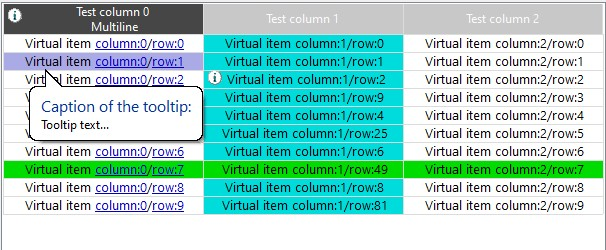

## **Introduction**
**CListEx** is an advanced owner-draw **List Control** class, written in pure Win32 API.


## Table of Contents
* [Features](#features)
* [Installation](#installation)
* [Creating](#creating)
    * [Manually](#manually)
    * [In Dialog](#in-dialog)
* [Sorting](#sorting)
* [Editing Cells](#editing-cells)
* [Data Alignment](#data-alignment)
* [Public Methods](#public-methods)
   * [HideColumn](#hidecolumn)
   * [SetColumnEditable](setcolumneditable)
   * [SetHdrColumnIcon](#sethdrcolumnicon)
   * [SetHdrHeight](#sethdrheight)
   * [SetSortable](#setsortable)
* [Notification Messages](#notification-messages) <details><summary>_Expand_</summary>
   * [LISTEX_MSG_GETCOLOR](#listex_msg_getcolor)
   * [LISTEX_MSG_GETICON](#listex_msg_geticon)
   * [LISTEX_MSG_GETTOOLTIP](#)
   * [LISTEX_MSG_LINKCLICK](#listex_msg_linkclick)
   * [LISTEX_MSG_HDRICONCLICK](#listex_msg_hdriconclick)
   * [LISTEX_MSG_HDRRBTNDOWN](#)
   * [LISTEX_MSG_HDRRBTNUP](#)
   * [LISTEX_MSG_EDITBEGIN](#listex_msg_editbegin)
   * [LISTEX_MSG_SETDATA](#listex_msg_setdata)
* [Example](#example)

## [](#)Features
* [Editable cells](#editing-cells), not only the first column
* [Hyperlinks](#listex_msg_linkclick) in a cells' text
* [Tooltips](#setcelltooltip) for individual cells
* [Background and text color](#setcellcolor) for individual cells
* Many options to set individual colors for lots of list aspects with the [LISTEXCOLOR]
* Set header height and font
* Set header color for individual columns
* Individual text alignment for a header and column itself
* [Header icons](#listex_msg_hdriconclick)
* [Hiding individual columns](#hidecolumn)
* Innate ability to sort list columns with no additional effort
* Dynamically changed list's font size with the **Ctrl+MouseWheel**

## [](#)Installation
1. Add `ListEx.ixx` into your project
2. Import `ListEx` module and declare `CListEx` object somewhere:
```cpp
import ListEx;
LISTEX::CListEx myList;
```

## [](#)Creating

### [](#)Manually
`Create` is the main method to create **CListEx** control, it takes [`LISTEXCREATE`](#listexcreate) structure as an argument. It's also important to add handlers for two Windows messages, `WM_DRAWITEM` and `WM_MEASUREITEM`.
#### Example:
```cpp
CListEx myList;

LISTEXCREATE lcs;
lcs.uID = ID_MY_LIST;
lcs.hWndParent = m_hWnd;
lcs.rect = CRect(0, 0, 500, 300);
//lcs.fDialogCtrl = true; //If it's control in a Dialog.
myList.Create(lcs);

void CMyDialog::OnDrawItem(int nIDCtl, LPDRAWITEMSTRUCT lpDrawItemStruct)
{
	if (nIDCtl == ID_MY_LIST) {
		myList.DrawItem(lpDrawItemStruct);
		return;
	}

	CDialogEx::OnDrawItem(nIDCtl, lpDrawItemStruct);
}

void CMyDialog::OnMeasureItem(int nIDCtl, LPMEASUREITEMSTRUCT lpMeasureItemStruct)
{
	if (nIDCtl == ID_MY_LIST) {
		myList.MeasureItem(lpMeasureItemStruct);
		return;
	}

	CDialogEx::OnMeasureItem(nIDCtl, lpMeasureItemStruct);
}
```

### [](#)In Dialog
To create **CListEx** in a Dialog you can manually do it with the [Create](#manually) method.  
But most of the time you prefer to place a standard **List Control** onto a Dialog's template, by dragging it from the **Toolbox** within **Visual studio**.  
To use the latter approach follow these steps:
1. Put a standard **List Control** from the toolbox onto your dialog.
2. Declare `CListEx` member variable within your dialog class.
3. In your `OnInitDialog` method call the `m_myList.CreateDialogCtrl(ID_MY_LIST, m_hWnd);` method.

## [](#)Sorting
To enable sorting set the [`LISTEXCREATE::fSortable`](#listexcreate) flag to `true`. In this case when you click on the header list will be sorted according to the clicked column. By default **CListEx** performs lexicographical sorting.  
To set your own sorting routine use the [`SetSortable`](#setsortable) method. 

## [](#)Editing Cells
By default **CListEx** works in the read-only mode. To enable cells editing call the [`SetColumnEditable`](#setcolumneditable) method with the column ID which cells you wish to become editable.

## [](#)Data Alignment
Classical List Control allows setting an alignment only for a header and column  simultaneously.  
**CListEx** allows setting alignment separately for the header and the data. The `iDataAlign` argument in the `InsertColumn()` method is responsible exactly for that.

## [](#)Public Methods
`CListEx` class also has a set of additional methods to help customize your control in many different aspects.

### [](#)HideColumn
```cpp
void HideColumn(int iIndex, bool fHide);
```
Hide or show column by `iIndex`.

### [](#)SetColumnEditable
```cpp
void SetColumnEditable(int iColumn, bool fEditable);
```
Enables or disables edit mode for a given column.

### [](#)SetHdrColumnIcon
```cpp
void SetHdrColumnIcon(int iColumn, int iIconIndex, bool fClick = false);
```
Sets the icon index in the header's image list for a given `iColumn`. To remove icon from column set the `iIconIndex` to `-1`.  
Flag `fClick` means that icon is clickable. See [`LISTEX_MSG_HDRICONCLICK`](#listex_msg_hdriconclick) message for more info.

### [](#)SetHdrHeight
```cpp
void SetHdrHeight(DWORD dwHeight);
```

### [](#)SetSortable
```cpp
void SetSortable(bool fSortable, PFNLVCOMPARE pfnCompare = nullptr, EListExSortMode enSortMode = EListExSortMode::SORT_LEX)
```
**Parameters:**  
`bool fSortable`  
Enables or disables sorting

`PFNLVCOMPARE pfnCompare`  
Callback function pointer with the type `int (CALLBACK *PFNLVCOMPARE)(LPARAM lParam1, LPARAM lParam2, LPARAM lParamSort)` that is used to set your own comparison function. If it's `nullptr` **CListEx** performs default sorting.  
The comparison function must be either a static member of a class or a stand-alone function that is not a member of any class.

`EListExSortMode enSortMode`  
Default sorting mode for the list.

## [](#)Notification Messages
These messages are sent to the parent window in form of `WM_NOTIFY` Windows messages.  
The `lParam` will contain a pointer to the `NMHDR` standard Windows struct. `NMHDR::code` can be one of the `LISTEX_MSG_...` messages described below.

### [](#)LISTEX_MSG_GETCOLOR
When in Virtual Mode this message is sent to the parent window to retrieve cell's color information.
```cpp
void CListDlg::OnListExGetColor(NMHDR* pNMHDR, LRESULT* /*pResult*/) {
    const auto pLCI = reinterpret_cast<PLISTEXCOLORINFO>(pNMHDR);
    if (pLCI->iSubItem == 1) { //Column number 1 (for all rows) colored to RGB(0, 220, 220).
        pLCI->stClr = { RGB(0, 220, 220), RGB(0, 0, 0) };
    }
}
```

### [](#)LISTEX_MSG_GETICON
When in Virtual Mode this message is sent to the parent window to retrieve cell's icon index in the list internal image list.
```cpp
void CListDlg::OnListExGetIcon(NMHDR* pNMHDR, LRESULT* /*pResult*/) {
    const auto pLII = reinterpret_cast<PLISTEXICONINFO>(pNMHDR);
    ...
    pLII->iIconIndex = 1; //Icon index in the list's image list.
}
```
### [](#)LISTEX_MSG_GETTOOLTIP
Sent to the parent window in Virtual Mode to retrieve cell's tooltip information.
```cpp
void CListDlg::OnListGetToolTip(NMHDR* pNMHDR, LRESULT* /*pResult*/) {
    const auto pTTI = reinterpret_cast<PLISTEXTTINFO>(pNMHDR);
    const auto iItem = pTTI->iItem;
    
    static constexpr const wchar_t* ttData[] { L"Cell tooltip text...", L"Caption of the cell tooltip:" };
    pTTI->stData.pwszText = ttData[0];
    pTTI->stData.pwszCaption = ttData[1];
}
```

### [](#)LISTEX_MSG_LINKCLICK
List embedded hyperlink has been clicked. `WM_NOTIFY` `lParam` will point to the `LISTEXLINKINFO` struct.  

Hyperlink syntax is: `L"Text with the <link="any_text_here" title="Optional tool-tip text">embedded link</link>"`  
If no optional `title` tag is provided then the link text itself will be used as hyperlink's tool-tip.  
The `link` and the `title`'s text must be quoted `""`.

### [](#)LISTEX_MSG_HDRICONCLICK
Header icon that previously was set by the [`SetHdrColumnIcon`](#sethdrcolumnicon) method has been clicked.  
Example code for handling this message:
```cpp
BOOL CMyDlg::OnNotify(WPARAM wParam, LPARAM lParam, LRESULT* /*pResult*/) {
    const auto pNMI = reinterpret_cast<LPNMITEMACTIVATE>(lParam);

    if (pNMI->hdr.code == LISTEX_MSG_HDRICONCLICK && pNMI->hdr.idFrom == IDC_MYLIST) {
    	const auto pNMI = reinterpret_cast<NMHEADERW*>(lParam);
    	//pNMI->iItem holds clicked column index.
    }
    ...
}
```

### [](#)LISTEX_MSG_EDITBEGIN
Sent when an edit box for cell's data editing is about to show up. If you don't want it to show up, you can set the `PLISTEXDATAINFO::fAllowEdit` to `false` in response.
```cpp
BOOL CMyDlg::OnNotify(WPARAM wParam, LPARAM lParam, LRESULT* /*pResult*/) {
    const auto pLDI = reinterpret_cast<LISTEX::PLISTEXDATAINFO>(pNMHDR);
    ...
    pLDI->fAllowEdit = false; //Edit-box won't show up.
}
```

### [](#)LISTEX_MSG_SETDATA
Sent in Virtual Mode when cell's text has been changed. 
```cpp
BOOL CMyDlg::OnNotify(WPARAM wParam, LPARAM lParam, LRESULT* /*pResult*/) {
    const auto pLDI = reinterpret_cast<PLISTEXDATAINFO>(pNMHDR);
    
    const auto pwszNewText = pLDI->pwszData;
    ...
}
```

## [](#)Example
Let’s imagine that you need a **CListEx** control with the non standard header height, and yellow background color.
Nothing is simpler, see the code below:
```cpp
LISTEXCREATE lcs;
lcs.rect = CRect(0, 0, 500, 300)
lcs.hWndParent = m_hWnd;
lcs.dwHdrHeight = 50;
lcs.stColor.clrListBkOdd = RGB(255, 255, 0);
lcs.stColor.clrListBkEven = RGB(255, 255, 0);

CListEx myList;
myList.Create(lcs);
myList.InsertColumn(...);
myList.InsertItem(...);
```
Here we set both even and odd rows to the same yellow color.